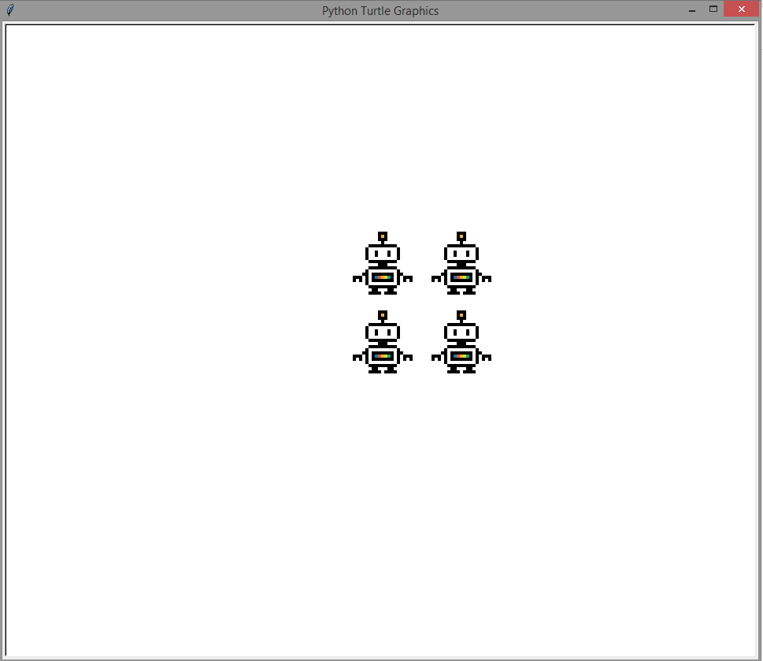
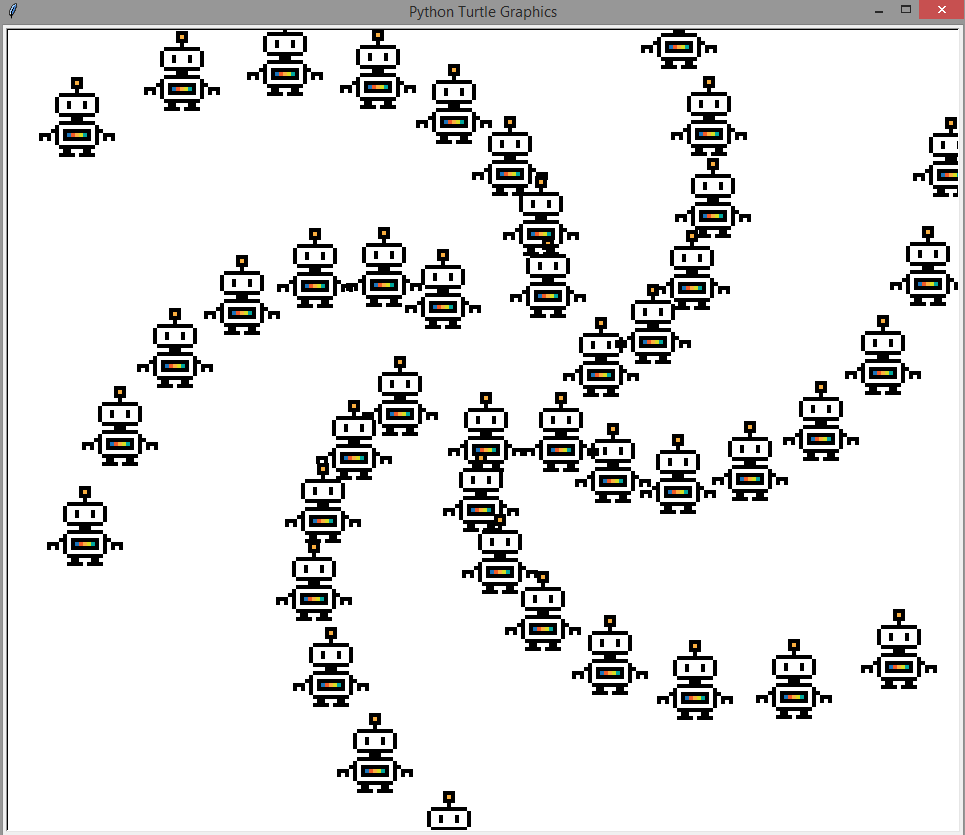

Homework for Week 4
===================

Exercises
---------

Advanced Modulo Practice
***********************

Modulo tells you the remainder from a division. 
The best way to think about this is to think about how many units are left until the next multiple. 

Modulo is really really useful with :code:`for` loops!

Example: 
- imagine you have a chicken that lays eggs.  
- You have a computerized chicken hutch, so you know her total count of eggs. 
- You want to only go in and get eggs when she has laid 12 of them.  
- But you've had the chicken for so long, the total count is really high. 
- One way of knowing how many are left until 12 is using modulo. 
- Using modulo like this: :code:`total_count % 12` will be 0 when the total_count is a multiple of 12. 

So, whatever modulo we are doing (12 in the egg example) lets us count to that number over and over!

Another Example:
- You want to count the beats in 4s and you know the total beats so far in a variable called :code:`beats`
- You can use modulo to find out which beat you are on, like this: :code:`beats % 4`. 

Final Example:

- The chinese horoscope! 
  + (Also, Happy Chinese New Year!)
- With the horoscope, there are 12 animals.  
- Each year is assigned an animal 
- every 12 years, the sequence of animals starts over!

**Your task**

- Write your own mini horoscope. It should be at least three animals (or something else you'd like). 
- You also have to choose a year in which your horoscope began!
- Using :code:`input`, ask the user how old they are 
    + (remember to convert the input to an integer or float!).

- Depending on their age, use modulo to find their horoscope!   
- You should use :code:`if` and :code:`elif` statements.  
- Remember that if you modulo by 3, then the result can only be 0, 1, or 2.
- If you modulo by 5, the result can only be 0, 1, 2, 3, or 4. 

This time, I am going to give you less code to start with.
If you are unsure of how you should start, please go back to previous exercises to find 
code that kind of does what you want.  Then, use that as a clue for how you can do what you want now!

.. code-block:: python
    ### structure of solution
    
    ### get the user's age using input
    
    ### compute the modulo and save it to a variable
    
    ### use if statements to test for different values
    #### each value is a different horoscope!

**bonus**

You could store horoscope messages in a list:

.. code-block:: python
    :linenos:
    
    fruit_horoscopes = list()
    
    banana_horoscope = "You are a banana!"
    fruit_horoscopes.append(banana_horoscope)
    
    apple_horoscope = "You are an apple!"
    fruit_horoscopes.append(apple_horoscope)
    
And then you can use the modulo result to index into the list!
In other words, you can do

.. code-block:: python
    
    fruit_horoscopes[1]
    
To get the apple horoscope, and you can do 

.. code-block:: python
    
    horoscope_index = (2007 - 1900) % 2
    
To get the number 1 as an integer.  
You can combine these to replace the :code:`if` statements if your previous example!

Extra Things
------------

Gifs with Turtles
*****************

Using the gifs with turtles requires that you have a gif file in the same folder as your python file. 
If you started a project in pycharm, it should have made you select a folder, and therefore you know where your python file is at. 

One way to find good gifs is use to `google's advanced image search <https://www.google.com/advanced_image_search?hl=en&fg=1>`_.
    - There is a "file type" option. Use it to select gif.  
    - I would recommend also selecting "icon" under "image size" as well. Then, search for whatever you want! 

I searched for robots and I found the one below.  Note that for animated gifs, the animation won't be shown!  Only the first frame.

**Make sure the file is in the same folder as your python file!!!**

Once a gif file is in the same folder as your file, you can then do:

.. code-block:: python
    :linenos:
    
    import turtle
    turtle.register_shape('robot.gif')
    
    bob = turtle.Turtle()
    bob.shape('robot.gif')
    
    turtle.done()
    
For fun, you could make the pen go up and just stamp:

.. code-block:: python
    :linenos:    
    
    bob.penup()
    for i in range(4):
        bob.stamp()
        bob.forward(200)
        bob.left(90)
        
        
This leads to fun things like these:

